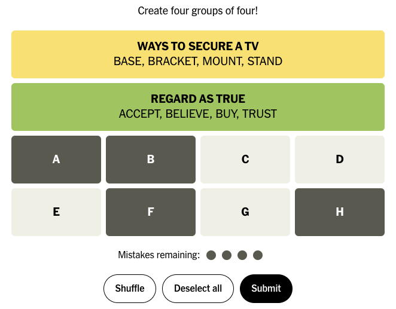

# Guessing the final connections in the NYT Connections game

This project addresses a question raised by [John Olson](https://www.facebook.com/heliopsis)
and studied by him in [this document](https://docs.google.com/document/d/1-Yq24GkJM4KwVuM0WSk85fZEpKLdXX99ZjxP1Eh3mFQ/edit?usp=sharing).

The [Connections](https://www.nytimes.com/games/connections) game in the New York Times presents a
grid of 16 items, where the goal is to divide the items into 4 sets, where the items in each set
are connected in some way. So for example a set might be {MELT, VAPORIZE, CONDENSE, FREEZE}, where
the connection is that they are changes from one state of matter to another. (This game is clearly
inspired by the Connecting Wall from the [Only Connect](https://en.wikipedia.org/wiki/Only_Connect)
quiz show on the BBC.)

You are allowed 3 incorrect guesses, but at the 4th incorrect guess you lose. After each
guess, the game will tell you if the guess is correct, and it will also say "one away" if 3 of
the items are part of a connection but the other is not. It won't tell you which is the odd one
out, though. If it says neither "correct" nor "one away" then at most two of the items belong to the
same connection.

John's question then is this. Suppose you have determined 2 of the 4 connections, so you have
eliminated 8 of the 16 items. But you have no clue as to what the remaining connections are. Is
there a strategy you can follow to derive the connections within the allowed number of guesses?
John's analysis shows that the answer is no. But we can ask some follow-on questions. There are 35
possible ways in which the 8 remaining items can be split into connections. With an ideal strategy,
how many of those ways can we expect to guess correctly with 4 guesses in total? How many guesses
would we need in order to be sure of finding the connections?

## Analysis

Following John's lead, let's call the 8 items ABCDEFGH. Then a connection is for example ABCD. It is
equivalent to EFGH, since if ABCD is a connection then EFGH must be the remaining connection and it
doesn't matter which order we guess them in. So we can assume that the connection we are looking for
contains A. Every solution will contain A in one or the other of its connections.

Similarly, *guessing* ABCD is equivalent to guessing EFGH. "One away" now means that either 2 of BCD
belong in a connection with A, or none of them does. If none of BCD belongs then 3 of EFGH must form
a connection with A, so we are still one away. If the game says nothing, then exactly one of BCD
belongs in a connection with A, and we can call that "two away".

The total number of possible connections containing A is the total number of ways to choose the 3
remaining items in the set out of the 7 possible items BCDEFGH, which is 7C3 = 35. We could
obviously swap around these items in any way without changing the problem, so an initial guess of
ABCD is as good as any other. So let's assume that initial guess. It divides the 35 possible
connections like this:

|          |        |
|----------|--------|
| correct  | {ABCD} |
| one-away | {ABCE,ABCF,ABCG,ABCH,ABDE,ABDF,ABDG,ABDH,ACDE,ACDF,ACDG,ACDH,AEFG,AEFH,AEGH,AFGH} |
| two-away | {ABEF,ACEF,ADEF,ABEG,ACEG,ADEG,ABFG,ACFG,ADFG,ABEH,ACEH,ADEH,ABFH,ACFH,ADFH,ABGH,ACGH,ADGH} |

If the connection is ABCD then we are done. Otherwise, we are back to a smaller version of the same
problem: we have a set of possible connections, and we want to know how many we can find with our
3 remaining guesses. If the game said "one away" then the 14 possible connections shown in the
table are {ABCE,ABCF,ABCG,ABCH,ABDE,ABDF,ABDG,ABDH,ACDE,ACDF,ACDG,ACDH,AEFG,AEFH,AEGH,AFGH} and we
can consider every possible guess. Again we need only consider guesses with A in them, because
guessing ABCD is the same as guessing EFGH. Let's say we guess ABCE. Then our new table is this:

|          |        |
|----------|--------|
| correct  | {ABCE} |
| one-away | {ABCF,ABCG,ABCH,ABDE,ACDE,AFGH} |
| two-away | {ABDF,ABDG,ABDH,ACDF,ACDG,ACDH,AEFG,AEFH,AEGH} |

After our 2 guesses ABCD, ABCE, we have found 2 connections and we have 2 guesses remaining.
Looking at the one-away set, we might guess ABCF, giving us this:

|          |        |
|----------|--------|
| correct  | {ABCF} |
| one-away | {ABCG,ABCH} |
| two-away | {ABDE,ACDE,AFGH} |

And again looking at the one-away set, we might guess ABCG. We're out of guesses now, so either it
is ABCG or it isn't; it doesn't matter if a guess is one away or not now.

The above looks at just one chain of guesses. But what we actually want to do at each point is
consider *every* possible guess and determine which one produces the most solutions. When
we have a set of _n_ possible connections, it seems the best we can do is to guess something that
will split those connections into one correct item plus one-away and two-away sets that are about
the same size. We saw that actually the initial one-away and two-away sets have sizes 16 and 18, and
since all initial guesses are equivalent that is the best we can do. That incidentally gives us
another way to answer the initial question: are 4 guesses enough? The answer is no, because at best
each guess splits the remaining possibilities evenly, so we would have:

| guess | connections | split       |
| ----: | ----------: | :---------- |
| 1     | 35          | (1, 17, 17) |
| 2     | 17          | (1, 8, 8)   |
| 3     | 8           | (1, 4, 3)   |
| 4     | 4           | (1, 2, 1)   |
| 5     | 2           | (1, 1, 0)   |
| 6     | 1           | (1, 0, 0)   |

At each point we assume that we were able to guess one of the currently-possible connections and
that the remaining connections were split as evenly as possible. Then at the next step we assume we
start with one of the splits, the larger one if they were not the same size. This is a lower bound
on the actual number of guesses needed. We can see that 4 guesses are indeed not enough, and 5
aren't either, but 6 are.

## How many connections can we expect to find?

An ideal strategy will find one connection at each guess and then split the remaining possible
connections into 2 non-empty sets for one-away and two-away.

The game allows us 4 guesses. We can count the number of connections using this ideal strategy by
working backwards. At the 4th guess we will find 1 connection. At the 3rd guess we will find 1
connection plus 1 more for each of the 2 sets we can try for the 4th guess, for a total of 3. At
the 2nd guess we will find one connection plus 3 more for each of the 2 sets, for a total of 7. At
the 1st guess we will find one connection plus 7 more for each of the 2 sets, for a total of 15. So
*at best* we can find 15 connections. And in fact we *can* achieve that. The diagram in [John's
document](https://docs.google.com/document/d/1-Yq24GkJM4KwVuM0WSk85fZEpKLdXX99ZjxP1Eh3mFQ/edit?usp=sharing)
shows one way of doing it: there are 15 boxes in the diagram and in each one we can guess the
highlighted word, or any word if none is highlighted.

Counting the same way, this ideal strategy would allow us to find 31 solutions in 5 guesses. But in
fact there is no such strategy. The program here enumerates every strategy and the best ones find
28 solutions in 5 guesses. It also confirms that 6 guesses are enough to find all 35 solutions.

## Can it make sense to guess a connection that is not possible?

After any sequence of guesses, there is a set of connections that are possible given the answers so
far. But there is no requirement that the next guess has to be in that set. If it isn't, then that
guess is "wasted" in that it doesn't allow us to increase the set of already-found connections. But
might it be that we will improve the final outcome with such an impossible guess?

It is generally better for a guess to divide the possible connections into one-away and two-away
sets that are about equal in size. If one of them is much larger than the other then we won't learn
as much from the smaller one, and we'll need to use more guesses to divide up the larger one. So we
can imagine that sometimes it might indeed be better to choose an impossible guess if it divides the
remaining possibilities more evenly.

Here's an actual example that the program here finds. Suppose the set of possible connections is
{ABEH,ABFG,ACEG,ADEF} and there are 3 guesses remaining. This set is unusual in that each connection
is two away from each other connection. So no matter which one we guess, we will get something like
this:

|          |                  |
|----------|------------------|
| correct  | {ABEH}           |
| one-away | {}               |
| two-away | {ABFG,ACEG,ADEF} |

The one-away set is empty, meaning that we will never get that answer for any of the connections in
the set. We only have the two-away set, and we are in the same situation again: our set is
{ABFG,ACEG,ADEF} and no matter which connection we guess, we will score that connection but then be
left with the other 2 in the two-away set. We can guess one, and if the solution is the other one we
lose. In total this method has found 3 of the 4 original connections.

On the other hand, we can try guessing AEGH, even though that is not a possible connection. Then the
outcome is this:

|          |             |
|----------|-------------|
| correct  | {}          |
| one-away | {ABEH,ACEG} |
| two-away | {ABFG,ADEF} |

Now we can use our 2 remaining guesses to guess each of the 2 possible connections on the one-away
branch and on the two-away branch. So this method will find all 4 of the 4 original connections.

With 4 guesses, it doesn't matter whether we require each guess to be a possible connection. We can
find 15 connections either way. But with 5 guesses, it does matter: we can only find 26 connections
instead of 28. And even with 6 guesses, we can only find 33 of the 35.